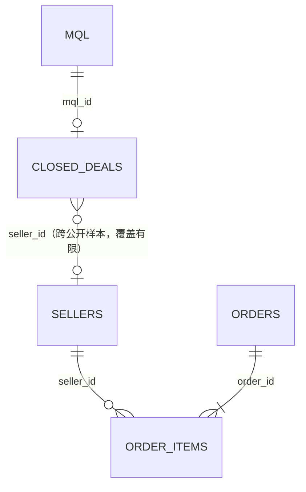

# 数据字典与五表关系

## 关系概览

营销漏斗数据和电商数据来自两个公开样本。`mql_id` 在营销两表之间完整匹配；`seller_id` 跨样本只能映射 380/842 个成交商家，所以它是**可观测覆盖关系**，不是完整业务主数据关系。

## 1. `olist_marketing_qualified_leads_dataset`

- 粒度：每条营销合格线索（MQL）一行。
- 主键：`mql_id`，8,000 行、无重复、无缺失。
- 使用字段：
  - `mql_id`：连接成交表。
  - `first_contact_date`：线索期、90 天观察窗起点。
  - `origin`：获客渠道；60 条缺失，单列为 `(missing)`。
- 未用于本分析：`landing_page_id`。它适合落地页分析，但当前案例不混入新的维度。

## 2. `olist_closed_deals_dataset`

- 粒度：每个已成交 MQL 一行。
- 主键：`mql_id`，842 行、无重复；全部可回连 MQL 表。
- 使用字段：`mql_id` 标记成交，`seller_id` 尝试映射电商商家，`won_date` 排除成交前订单。
- 数据质量：1 条记录的 `won_date` 早于 `first_contact_date`；保留在成交率审计中，但时间逻辑会阻止成交前订单进入 90 天价值。
- 未用于本分析：商家类型、规模、业务细分、获客代表等字段；它们可用于后续分层，但不是当前核心问题所必需。

## 3. `olist_sellers_dataset`

- 粒度：每个公开电商样本商家一行。
- 主键：`seller_id`，3,095 行、无重复、无缺失。
- 使用字段：`seller_id`，用于确认成交商家是否在订单样本中可观测。
- 未用于本分析：邮编、城市、州。当前不做地域归因，避免扩大问题范围。

## 4. `olist_orders_dataset`

- 粒度：每个订单一行。
- 主键：`order_id`，99,441 行、无重复、无缺失。
- 使用字段：`order_id` 连接订单商品表；`order_status` 仅纳入 `delivered`；`order_purchase_timestamp` 判断是否落入首次接触后的 `[0, 90)` 天且不早于 `won_date`。
- 未用于本分析：客户、审批、发货、签收、预计交付字段。它们适合物流体验分析，不属于当前渠道价值问题。

## 5. `olist_order_items_dataset`

- 粒度：订单中的每个商品序号一行。
- 复合主键：`order_id + order_item_id`，112,650 行、无重复、无缺失。
- 外键：`order_id → orders`、`seller_id → sellers`，本次文件内均完整匹配。
- 使用字段：`seller_id` 把商品金额归到正确商家，`order_id` 按 MQL 统计去重订单数，`price` 汇总商品 GMV。
- 未用于本分析：`freight_value`、商品 ID、最晚发货时间。GMV 明确不含运费。

## 为什么必须从商品行连接

公开样本中有 1,278 个多商家订单。若先把整单金额汇总后再按订单连接商家，同一订单可能被重复分配给多个商家，造成 GMV 膨胀。本项目在 `seller_id + order_id + order_item_id` 粒度筛选有效商品行，再按 MQL 汇总：商品金额只属于该商品行对应的商家，订单数才使用 `COUNT(DISTINCT order_id)`。

